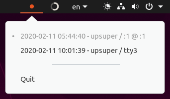

# gnome-who

Small program to list current login sessions from system tray.
It shows a red indicator when there are more than one sessions exist,
indicating you left other session open,
or someone else is accessing your system.

## Screenshot



## Build / Installation

There is currently no artifact provided,
so you would have to build it from source code.

You would need development libraries for GTK3 and libappindicator to build.
On Ubuntu, you can install them via
```bash
sudo apt install libgtk-3-dev libappindicator3-dev
```

With [Rust](https://www.rust-lang.org/) installed,
you can use
```bash
cargo install --git https://github.com/upsuper/gnome-who.git
```
to install.

## License

Copyright (C) 2020 Xidorn Quan

This program is free software: you can redistribute it and/or modify it under the terms of the GNU General Public License as published by the Free Software Foundation, either version 3 of the License, or (at your option) any later version.

This program is distributed in the hope that it will be useful, but WITHOUT ANY WARRANTY; without even the implied warranty of MERCHANTABILITY or FITNESS FOR A PARTICULAR PURPOSE. See the GNU General Public License for more details.

You should have received a copy of the GNU General Public License along with this program. If not, see https://www.gnu.org/licenses/.
